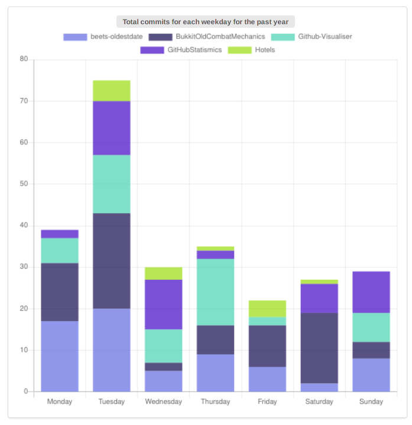

# GitHubStatismics

A simple GitHub statistics visualiser. Allows entering a username to view some statistics and graphs. Written in Kotlin using [KWeb](http://kweb.io) with [FomanticUI](https://fomantic-ui.com) and [ChartJS](https://www.chartjs.org/).

## Requirements

Authentication via a property file ~/.github is necessary. Please see [here](https://github-api.kohsuke.org/index.html) for more details. An OAuth Personal Access Token with no additional scopes is recommended. If running through docker, the token file is to be bound to `/home/kweb/.github`.

## Building the project

The project can be built using Gradle. Issuing the command `gradle build` will start a build and the resulting Jar can be found in `build/libs/GitHubStatismics.jar`.

## Building the docker image

If you want to run the project using docker, you must build the image using the provided (or compatible) Dockerfile:

```
docker build -t <image_name> .
```

## Running

Without docker simply run `gradle run` and navigate to http://0.0.0.0:16097, or corresponding address as printed out in the console output.  
Using docker, run `docker run -d -p 16097:16097 --name <image_name>` and navigate to `http://<image_name>:16097`, or whatever external port you specified in the command.

# Project overview

### Search
On this screen the user can enter a GitHub username to search and load statistics for. None of the data tabs will be loaded if no user has been entered yet.


### Loading
The user will then get some visual feedback as the data relevant to the chosen user will start to appear. Whilst the data is being fetched loading animations will appear on the individual components that are loading. This also happens on the chart pages. This is especially useful when a different user is selected and the old data is still present before the new one is loaded in.


### Stats tab
The first tab is the stats tab. This tab includes information on the chosen username, including full name, avatar image, biography, location, following, followers, and repositories. All of the user avatars are displayed and link to the users' profiles. All of the repositories listed link to the repository pages. Clicking on any of the usernames will load up that user in the program.


### Pie charts
The second tab displays many pie charts with data from the user's various repositories. The first graph displays programming languages by amount of bytes across all repositories. Clicking on any of the data labels in any of the charts will exclude that piece of data and redraw the chart. This comes in handy for example if we want to exclude HTML and CSS from the chart.


This tab also contains other pie charts detailing many stats that can be useful in determining the skills of the chosen user as a software engineer, or simply the success of their open source projects. We can find pie charts with the size, forks, stargazers, watchers, and open issues per repo.


### Time graphs
The third tab contains some time graphs with data from commits for the past year over all repos for the user. The first show the amount of commits per week, for all users over the past year. This is displayed as a coloured stacked bar graph, with commits over time. This allows seeing in which repositories the commits were made in each week as a component of the total. We may thus see the activity of the developers across the past year.


Next up is a line graph that shows the total amount of commits across all repositories owned by the chosen user over time, compared to the amount of commits made by the user. They are always drawn in this order so that it is easy to see if some of the repositories owned by the user were also contributed on by other users. This can give an indication of how collaborative their projects are, and by looking at the same timeframe in the graph above it is also possible to see what projects those might have been.


Finally, we have a stacked bar chart of the commits for each day of the week. This can show whether a user is more productive i.e. at the start of the week or on weekends, and, if for example at a workplace, things can be scheduled accordingly.



### Errors
There are also two possible errors that are displayed to the user through toast notifications. The first involves the case in which the entered user cannot be found. This most often happens when the username is not spelled correctly, and so the user is warned accordingly.


The second type of error happens when some of the data requested from the API is not available yet. Repository statistics in particular will only be served by GitHub if they are already cached. Otherwise, the service will return a 202 letting you know the information is being crunched. Thus, the user is informed that some of the data could not be loaded and to try again in a while. In the meantime, the data that was loaded can still be viewed.


